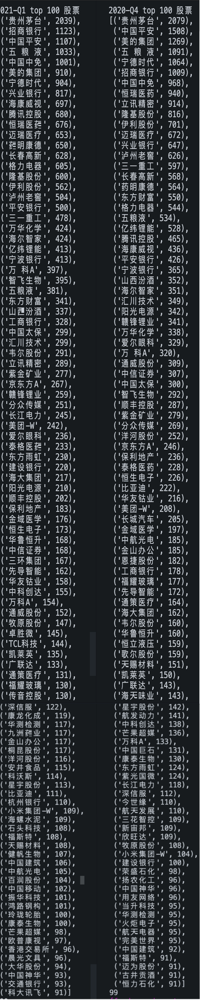
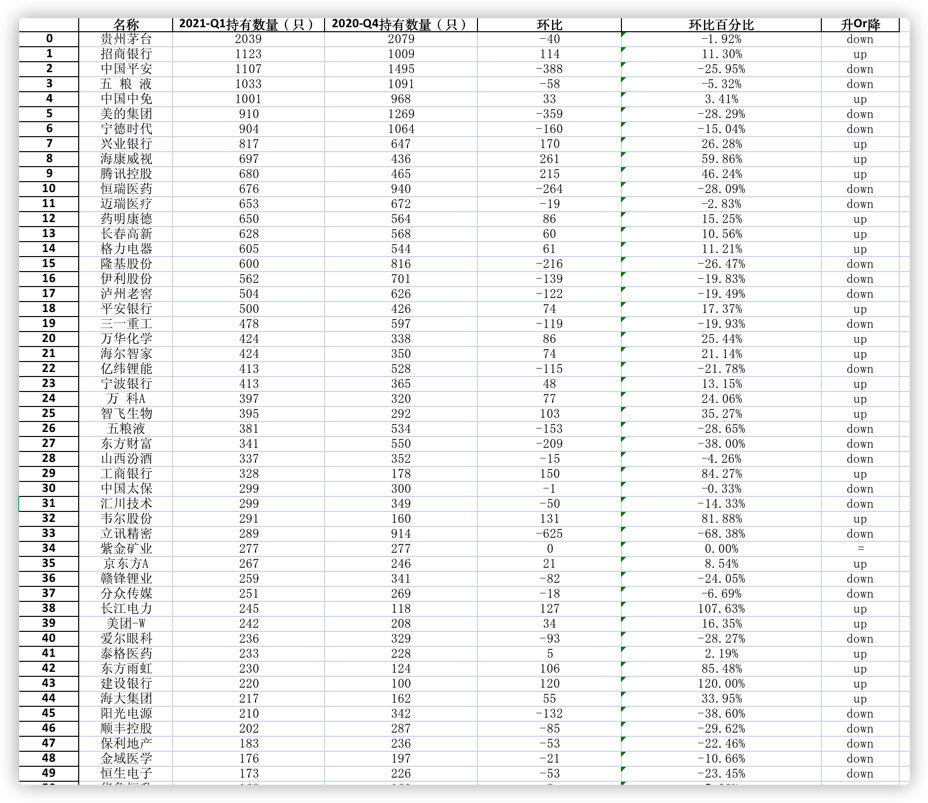
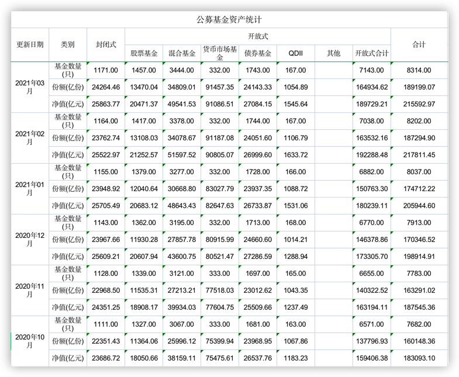
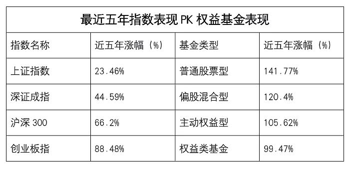

# 启程篇--慢慢变富，做时间的朋友

## 前言

不记得从什么具体时候开始接触理财投资，或许是大学时期看一些经济学相关的书籍引起了我对投资理财的兴趣。记得最开始是看茅于轼先生的《生活中的经济学》，再到著名经济学家萨缪尔森的《微观经济学》、《宏观经济学》、现代经济学之父亚当·斯密的《国富论》等，这些著作中使我对经济学有了启蒙的认识。比如“价格是由商品内在价值与供需关系决定的”、“资源的稀缺性是经济学的第一原则”、"效率与公平问题"、“市场经济与计划经济”等等。看了这些书籍之后，了解到货币通胀会使口袋中的真实人民币是会贬值的，物价上涨，购买力下降，所以就想到资本市场跃跃欲试。

刚开始是 16 年，大二的时候每个月从生活费中定期拿出一点钱定投基金，再到毕业后进入股票市场。在这一路以来，我一直在摸索一种稳健，不被每天的涨跌所焦虑的投资方式。

在基金投资方面，最初是在天天基金定投、跟买一些晨星评级高，收益不错的基金。慢慢又在其他理财平台探索，大概在两三年前，发现里[魔方理财](https://licaimofang.com/ "魔方理财")这平台，上面提供了 10 个风险等级不同的组合（当时第一次遇到基金组合这玩意）。你可以根据个人的风险喜好选择不同的组合跟投。我也试着跟投一段时间后，发现跟投组合里面的一些基金并不是多么优秀，也没什么跟投依据，最重要是组合的收益和自己预期不一样，所以我又转移了战场。接着发现了[且慢](https://qieman.com/ "且慢")，咋一看，这平台投资三观很正，再深入去了解它的理财产品，有官方的基金组合，大 V 的基金组合，还有基金公司官方的基金组合，然后就慢慢地就在且慢上跟投了，后面[蛋卷基金](https://danjuanapp.com/ "蛋卷基金")也推出了基金组合。现在我就在这两个平台上买基金，这在两年来涨的时候能获得稍微不错的超额收益，回撤风险也能控制不错。不用自己花太多时间去选基与关注每日的涨跌，当然我也不会去停止探索的脚步，其他更好的平台出现。

上面是我的基金投资历程，重点来了，股票呢？股票是我 19 年才进场的。三年以来，做过短线（包括追涨杀跌，跟大 V 推荐，炒概念等），也有慢慢静下来去看企业的基本面，财报（为此还看了几本会计书籍），不过研究透一个企业，一个行业哪有那么容易，还要去关注它后面的新闻，财报等，确实是一件不容易的事情。所以两年来摸索也没能从股票市场里面赚到多少钱（运气好，这两年股票市场总体上是不错的），还不如安安静静投基金好，承认自己就是普普通通的一位。

但是也对投资股票有了进一步的认识。好比"股价"相当于商品的价格，是由商品的自身的价值与供需关系决定的。股票的价格也是由其背后企业的基本面与投资者对它的买卖热情决定的，短期看来可能投资者买卖的热情影响了股价激烈波动，但是长期来看股价始终围绕着企业的价值波动。

股票投资很重要的两个因素是：**1. 选股，2.择时**。

1. 选股是基础，如果选择一只经营情况每况日下，夕阳行业的股票，后面一起的努力都是南辕北辙
2. 择时也很关键，比如一个股票其背后的企业经营一直蒸蒸日上，但是如果当前股价已经很高了，市盈率已经离谱了，这时候再进场的话，后面也许会面临很长的股价下调时期，这也是很煎熬的。

## 策略（方案）

既然股票投资两个重要因素是：1.选股，2. 择时，那有什么办法辅助我们投资吗？这就是这个号的初衷--利用公募基金的十大持仓数据辅助投资。大概的策略如下：
利用爬虫技术，爬取市面上每个基金的季度基本信息（最重要的是十大股票持仓信息），有了这些数据之后，对数据做过滤筛选、分析、统计出每一只股票的每个季度在市面上公募基金持有个数，再对结果进行排序，比较得到权重股。

如图所示：
2021 第一季度与 2020 第四季度的基金重仓前 100 股票。

_比如贵州茅台 2021-Q1 基金持仓数量为 2039 只，2020-Q4 基金持仓数量为 2079 只_

> 备注：数据统计是对基金股票持仓>= 20%的基金(过滤掉货币，以及债券型基金)

拿到最新的季度前 100 基金重仓股数据(辅助我们上面说的**选股**)，再和同一只股票的上一个季度持仓数量进行对比，得到如下结果：

对数据进行过滤，筛选出相对上个季度持有数据上升的股票（辅助我们上面说的**择时**）。将这些股票作为我们的研究池(当然也可以根据其他条件条件筛选出股票研究池，比如某一个基金公司基金重仓股，晨星评级高的基金基金重仓股等)，对研究池的股票进一步研究，加上自己的研究判断，最后选出自己的标的股。

为什么选择公募基金的重仓股为数据分析的入口呢？前面说了自己买股票的历程，非常折腾，但是最终的收益还不如安安静静的的买基金好，侧面说明了公募基金机构选股能力还是比较强，还是比较信赖的。更何况[公募基金的规模](https://www.amac.org.cn/researchstatistics/datastatistics/mutualfundindustrydata/ "公募基金的规模")越来越大，在资本市场的话语权越来越大，加上我们的数据是汇总市面上几千只基金而成，更具有代表性。

## 最后

目前上面的汇总数据所在项目--[fund-morning-star-crawler](https://github.com/jackluson/fund-morning-star-crawler "fund-morning-star-crawler")已经开源到 github 上，大家可以自行 fork 到本地运行。目前数据的展示，查询的 web 项目还在开发中，后续也会提供给大家使用。
这个号的初衷就是利用这些公募基金数据，经过我们的汇总，过滤分析得出最终的数据，我们称之为**锚点数据**。瞄准锚点数据，为我们的投资生涯赋能。当然投资是一门很深的学问，还需要我们身体力行。正如《聪明的投资者》说的:

> 要想在一生中获得投资成功，并不需要顶级的智商、超凡的商业头脑或者秘密信息，而是需要一个稳妥的知识体系作为决策的基础，并且有能力控制自己的情绪，使其不会对这种体系造成侵蚀。

“东方欲晓，莫道君行早。踏遍青山人未老，风景这边独好”，最后感谢大家的阅读与关注，祝大家都能做时间的朋友，获得人生投资道路的成功。

文章来源：微信公众号--锚点数据(微信号: anchor_data)，关注公众号，获取更多精彩内容

