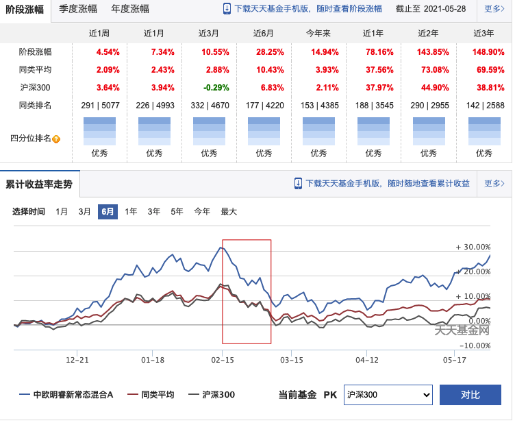

# 精心整理，给大家汇总一批性价比高的基金名单

## 基金指标

利用晨星网基金数据，根据基金关键指标筛选出近年来业绩优秀，性价比高的基金

[晨星网](http://www.morningstar.cn/ "晨星网")是国际权威评级机构 Morningstar 的中国官方网站，其数据是有很高的参考价值的。

下面介绍几个下文用到的基金指标：

- 晨星星级评价：
  > 晨星把每只具备 3 年以上业绩数据的基金归类，在同类基金中，基金按照“晨星风险调整后收益”指标（Morningstar Risk-Adjusted Return）由大到小进行排序：\
  > 前 10%被评为 5 星；\
  > 接下来 22.5%被评为 4 星；\
  > 中间 35%被评为 3 星；\
  > 随后 22.5%被评为 2 星；\
  > 最后 10%被评为 1 星。

- 夏普比率
  > 夏普比率是衡量基金风险调整后收益的指标之一，反映了基金承担单位风险所获得的超额回报率（Excess Returns），即基金总回报率高于同期无风险收益率的部分，一般情况下，该比率越高，基金承担单位风险得到的超额回报率越高。

通俗来讲：夏普比率越高，同样单位的风险下，获取到的收益越高，也就是**性价比**高。

> 关于更多的晨星指标请看：[http://www.morningstar.cn/help/data/fundrisk.html](http://www.morningstar.cn/help/data/fundrisk.html "http://www.morningstar.cn/help/data/fundrisk.html")

## 基金筛选条件

根据[晨星网基金筛选列表](https://www.morningstar.cn/fundselect/default.aspx "晨星网基金筛选列表")显示，目前有接近 1.3 万只基金。我们根据下面指标筛选出一批综合表现好，性价比高的基金。

1. 晨星评级：三年评级为 5，五年评级不低于 3 -- 基金表现的总体评价，这个指标可以过滤掉 90%的基金&成立时间低于 5 年的基金
2. 夏普比例：大于 1 -- 相同单位风险能获得更高的超额收益，数值越大，性价比越高
3. 持股仓位：大于 50% -- 确保是偏股权益基金，过滤掉债基与货币基金
4. 前十大仓位：低于 60% -- 防止持仓太集中，出现暴涨暴跌
5. 风险等级： 2 年，3 年，5 年 都不低于 2 -- 进一步的筛选掉风险太高的基金
6. 现任基金经理担任时间：不能低于 1 年 -- 排除依赖上一轮基金经理留下来的选股风格
7. 基金经理入行时间：不能低于 6 年 -- 为什么 6 年呢，2015 年到 2016 年有一轮大涨大跌的牛市，至今差不多 6 年，经历过一轮牛熊的基金经理具有更丰富的市场经验
8. 主动基金： 过滤掉指数型基金

根据以上指标，我们从接近 1.3 万只基金中选出来几十只基金。这些基金的都是非常优秀的，以后我会定期向大家输出这份基金表单

如果有同学需要 2020-Q4 数据的名单，可以私信我

## 分析因素

买基金其实就是买基金经理以及其背后的基金公司的投研实力。
上面名单还是好几十只基金，全部买是不可能的，结合根据自己的风格，风险喜好，资产配置等情况筛选。

可以再从下面几个方面去考虑：

1. 股票的总仓位以及前十大仓位 -- 观察这个指标，结合该基金的收益以及回撤情况与沪深 300 指数的收益与回撤情况对比，判断这个股票的风险控制能力。一般收益与风险是相对的，收益越高，风险也会越高。 所以股票仓位越高的，回撤幅度一般也越大。所以能挑出高仓位，高收益，低回撤的基金是非常不错的。

2. 股票十大持股的风格以及集中度 -- 可以根据基金目前以及过往的仓位来判断该基金经理风格，布局板块。看看是否主要布局在科技股，生物医疗，或者白酒消费等，青睐低估值或者成长类的股票，或者是某一个行业基金（不要太相信基金的名字，名字是这个名字，但实际持仓股却不是这类股票）。

3. 持有人结构 -- 注意要看机构持有与个人持有的比率。一般来说机构持有比例高的基金差不了哪里去。

4. 基金换手率 -- 换手率，换手率越高，操作越频繁，越倾向于择时波段操作；基金换手率越低，操作越谨慎，越倾向于买入并持有策略。一般来说 300/400%正常，高于 500%就偏高了

> 注：基金持有人结构与换手率数据可以在天天基金查看，每半年统计一次数据

例如：从名单选择两支点评一下

1. 中欧明睿新常态混合 A（001811）

点评：明星基金经理，周应波，且其资历也是挺不错的，10 年从业经验，6 年管理基金经验。短期，长期收益都是非常不错的，股票仓位不高不低（88%），前十大持股比较分散，布局均衡，比较擅长挖掘大盘成长，科技类股，风控做得也比较好，同时是机构常驻基金（66%以上是机构持有）。

2. 上投摩根医疗健康股票（001766）
   

点评：基金经理，方钰涵，资历一般，8 年从业经验，3 年基金管理经验，短期，长期收益也是非常不错的，股票仓位不高（79.7%），行业基金，十大持股比较集中，布局医疗行业，风控做得较差，回撤幅度大幅大于沪深 300, 机构持仓 24.7%

大家可以根据自己的风格，风险喜好，资产配置等情况，选择适合自己的基金配置，名单上的基金就不一一点评了

## 最后

因为晨星网没有统计持有人结构比例与换手率数据，所以要手动去查看，后续尽快给大家补上这个维度数据，

文章来源：微信公众号--锚点数据(微信号: anchor_data)，关注公众号，获取更多精彩内容

