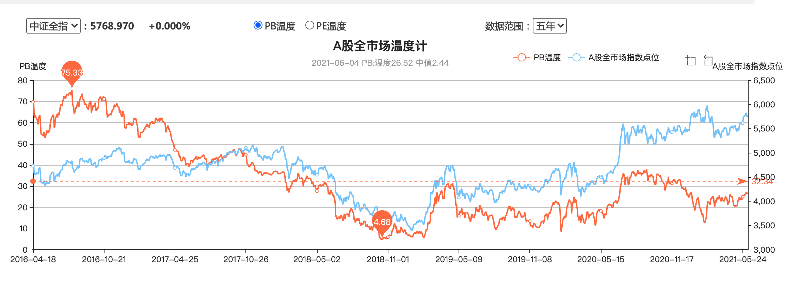
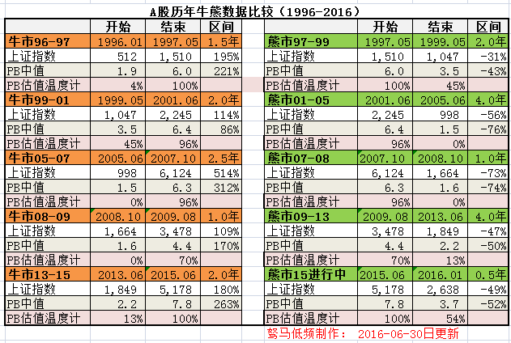
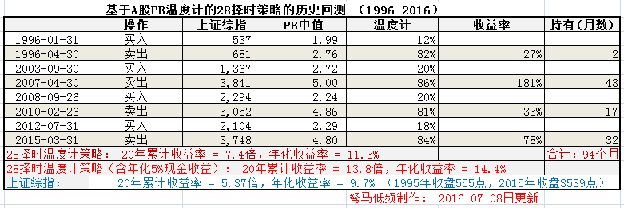

绿草地 | 题图：来源 pexels

最近在看同学推荐的张磊写的《价值》，书中谈及耶鲁大学捐赠基金的投资理念时说到：

> 当股市过热时，股票的大幅升值使实际的股票配置占比远高于长期目标，从而使系统自动产生卖出的信号，且这一信号随着股市屡破新高而越来越强烈，此时及时卖出促使资产配置比率恢复到长期投资所设定的目标，也使基金避免因贪婪所带来的风险；

此外，还曾有人戏谑称：“当买菜大妈开始涌入股市的时候，这个时候就应该撤退了”。这里的“大妈”并非指的是真正买菜大妈，而是泛指一些几乎没有什么金融知识的人。当这些人都进场了，往往说明了股市已经存在巨大的泡沫，面临着很高的泡沫破灭的风险了。

作为一位普通的投资者，该如何去衡量股市的热度，估值的高低呢，从而判断自己此时该不该进场呢？很多人不由自主地想到股票指数，根据股票指数走势来观察目前位置，例如上证指数、深证成指、创业板指。但是目前指数其实并不能全面，客观反应市场的热度与整体估值高低。就拿上证指数来说，指数的编制是根据企业的市值大小，加权平均得到的综合指数。但是上证指数成分股有"石油“，“银行”，“保险”等市值很大的企业，导致占比权重过高，使其走势并不能客观反应 A 股的整体股票的走势，更不能体现估值的高低，很显然，有些股票已经涨了好几倍，但是这么多年上证的走势几乎原地不动。

## 股市温度计

股市温度计可以理解成衡量股市热度及其估值的工具，市面上这些工具也是五花八门。我个人觉得集思录做得还不错，打开这个站点[https://www.jisilu.cn/data/indicator/](https://www.jisilu.cn/data/indicator/)可以看到如下样子：

从上图可以看出，2021-06-04 号这一天 PB 中值(可以切换 PE 维度统计)为 2.44， 温度为 20.52。
其背后涵义是当天的 PB 中值处于历史上 PB 中值的 20.52%的位置。这里简单说一下温度计统计涵义：统计当天 A 股所有股票的 PB 值，算出其中位数，再用这个中位数与历史上 PB 中位数比较得到的这个百分比，即是温度值。详情可以看[估值温度计：A 股的 20 年牛熊转折+PB 中值走势+28 择时策略+历史回测](https://www.jisilu.cn/question/68925)这篇文章，这样可以解决上面说的某一个股票因为其市值过大，导致权重占比过大的问题。

一般来说温度越低，PB 中值越低，A 股整体估值越低，越具有投资价值。下图是牛熊市的 PB 中值，从图可以看出如果能在熊市最低点买入，牛市最高点卖出，真的是赚翻了

## 基于 PB 中值二八择时策略

> 根据[估值温度计：A 股的 20 年牛熊转折+PB 中值走势+28 择时策略+历史回测](https://www.jisilu.cn/question/68925)文中的策略，其模型如下：

- 交易时间：月末
- 买入时机：当估值温度计 < 20%， 满仓买入；
- 卖出时机：当估值温度计 > 80%， 清仓卖出；
- 交易标的：上证综指

回测结果如下：可以看出回报是比上证指数优秀的

## 最后提示

上面的股市温度计是反映的是 A 股整体热度与估值，提供了 PB 与 PE 值这两个维度切换计算，一定程度上辅助我们买卖的择时，比较适用股票指数。但是也是有局限性的，不能一概而论。一般金融、周期、重资产重工业行业使用 PB 百分位估值，其他行业一般是根据 PE 百分比估值。如果具体到某只个股，不能只看"PB"或者"PE",更重要考虑是企业的基本面，具体情况具体分析。
