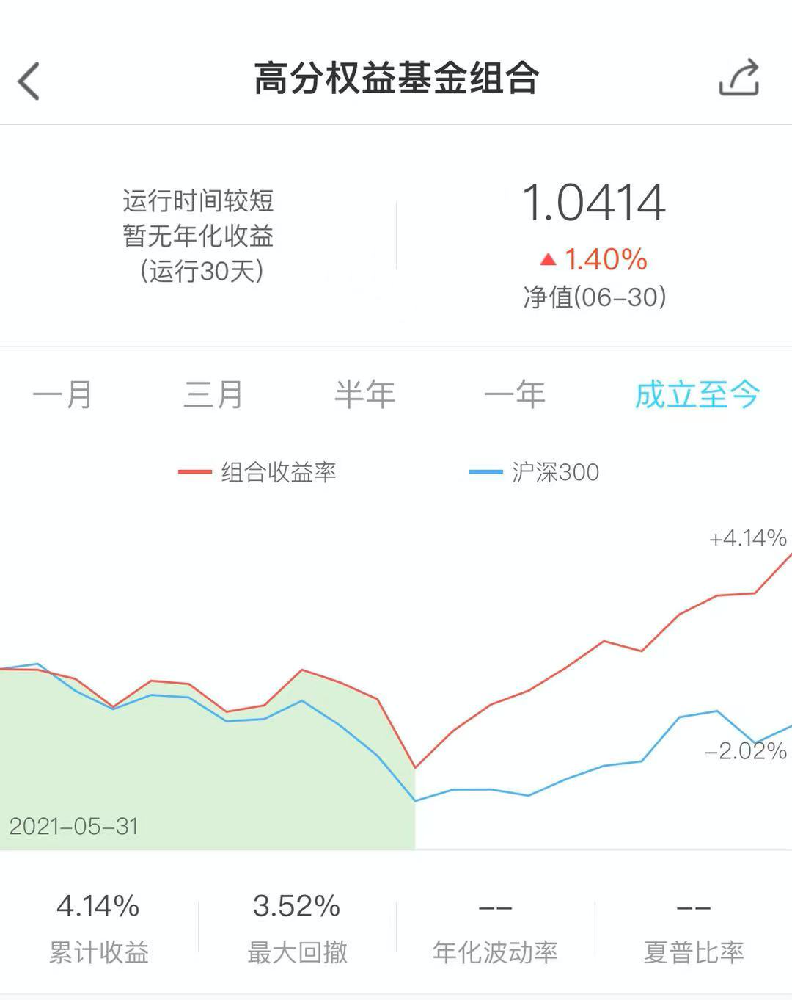
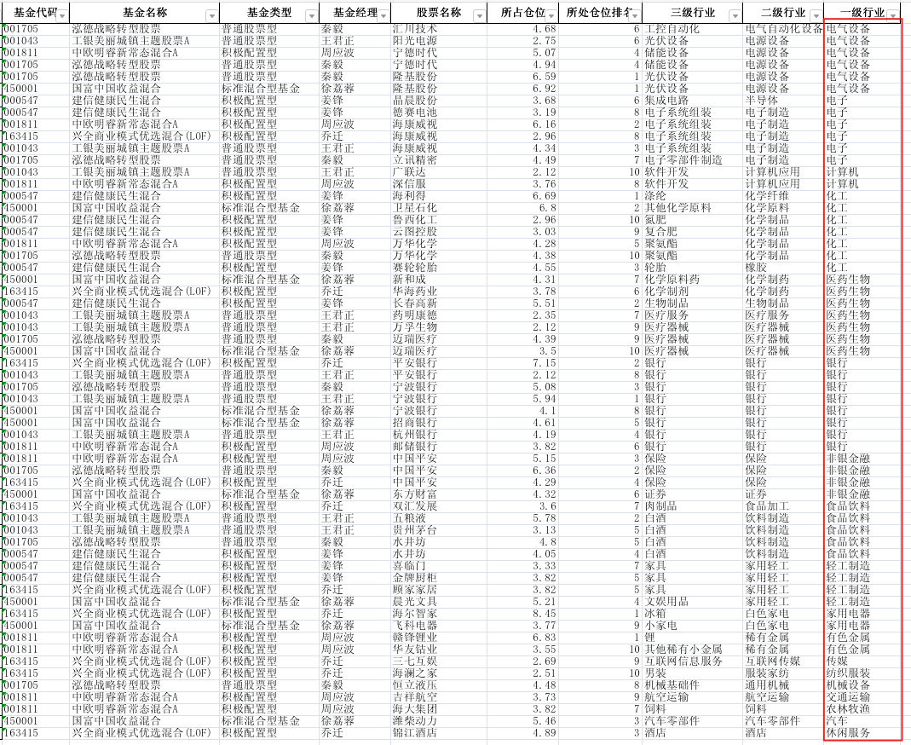

# 高分权益基金组合出炉介绍

近两年基金组合如雨后春笋一般涌现出来，自己也跟投了两年多。在研究、跟踪了许多大V与基金公司的组合之后，也决定自己创建一个属于自己的组合，以此实践，学习。组合名字暂且就叫“高分权益基金组合”吧，也挺符合的。

在上一次写了《精心整理，给大家汇总一批性价比高的基金名单》之后，就从中精选出6只基金创建了组合，目前组合已经运行一个月，先给大家汇总收益情况，如下：

6月份以来，沪深300指数涨幅：**-2.02%**， 组合收益：**4.14%** 跑赢沪深300指数 `6.16%`。还是非常满意这个结果的。如图所示：

下面郑重和大家介绍 **“高分权益基金组合”** 组合

## 目标
高分权益基金组合的目标是：**通过定量与定性的分析相结合、合理灵活的资产配置，争取超过基准收益，追求长期稳定且可持续的高收益，实现长期资本增值**

## 定量分析

之前写过一篇文章《精心整理，给大家汇总一批性价比高的基金名单》写过基金的入选条件是：

1. 晨星评级：三年评级为5，五年评级不低于3星  -- 基金表现的总体评价，这个指标可以过滤掉90%的基金&成立时间低于5年的基金
2. 夏普比例：大于1 -- 相同单位风险能获得更高的超额收益，数值越大，性价比越高
3. 持股仓位：大于50% -- 确保是偏股权益基金，过滤掉债基与货币基金
4. 前十大仓位：低于60% -- 防止持仓太集中，出现暴涨暴跌
5. 风险等级： 2年，3年，5年 都不低于2星 -- 进一步的筛选掉风险太高的基金
6. 现任基金经理担任时间：不能低于1年 -- 排除依赖上一轮基金经理留下来的选股风格
7. 基金经理入行时间：不能低于6年 -- 为什么6年呢，2015年到2016年有一轮大涨大跌的牛市，至今差不多6年，经历过一轮牛熊的基金经理具有更丰富的市场经验
8. 主动基金： 过滤掉指数型基金

依据这些条件筛选出来的基金，大概有50只左右。然后再根据组合目的，原则配置合理的基金。

 ## 定性分析
 
组合的力求配置均衡，布局大盘，中盘的成长价值型基金。

一般配置5到8只基金，太多的话，太分散，进攻性不强，很难获得高的超额收益，太集中的话，风险太大，所以选择5-8只基金。

配置要均衡，一个基金组合好比一个足球球队，有前锋负责进球的，中场球员负责传球的，后卫负责防守的。所以我们基金配置也一样，有负责追求高收益的成长性基金，也有防御性型低估值基金。尽量做到好的风险收益性价比高组合

选择好赛道，股市市场热点千遍万化，作为一个基金组合紧跟市场热点是不理智的。要选择一个常青赛道，比如：“科技，医疗，消费”，选择好的赛道，让雪球越滚越大。

基金经理，选择基金最重要是基金经理，以及背后基金公司投研实力，结合基金经理的长期业绩，基金公司投研实力，口碑，但尽量组合不能同时配置两支同一个基金公司的基金，与两支同一行业的基金。

## 组合基金
目前组合一个选择如下6只基金作为成分股
|  基金名称    |  仓位   |
|  ---        |  ---    |
|  中欧明睿新常态混合A  |  20%   | 
|  泓德战略转型股票   |  20%   | 
|  兴全商业模式优选混合   |  20%   |
|  工银美丽城镇主题股票A   |  20%   |
|  建信健康民生混合   |  10%  |
|  国富中国收益混合   |   10%  | 

### 组合基金指标

下图是上述各只成分基金的晨星评级，风险评级，夏普比率等信息

### 组合基金持仓股

- 中欧明睿新常态混合A

点评：中欧明睿新常态混合A — 明星基金，中大盘，布局均衡，热衷科技板块，新能源相关成长股, 机构持仓高

- 泓德战略转型股票

点评：泓德战略转型股票 — 秦毅，持股换手率非常低，选股注重成长，尤其是最近热门的光伏，新能源股，布局均衡，科技，医疗，从业时间稍短一点，但是机构持仓高（85%）

- 兴全商业模式优选混合

点评：兴全商业模式优选混合（LOF） — 乔迁，明星基金经理，收益不错，风控也到位，能涨抗跌性，布局很均衡，热衷在低估值个股

- 工银美丽城镇主题股票A

点评：工银美丽城镇主题股票A —  王君正/鄢耀， 机构重仓基金，布局也稍微均衡，专注白酒、消费、银行股，医药

- 建信健康民生混合

点评：建信健康民生混合 — 姜峰，专注挖掘中小盘成长股，灵活调动仓位，看重其回撤风险做得较好

- 国富中国收益混合

点评：国富中国收益混合 — 老牌基金经理，换手率极低，长期股票仓位不高(60%)，主要布局均衡，聚焦银行、医药、科技，没有白酒类，短期、长期大幅跑赢沪深300，风控(回撤)做得也非常好

最后按照行业分组汇总一下该组合的持仓股，如下图：

以上基金长期业绩都是很优秀的，有些风控能力做得也很好。总体来看目前组合配置是比较均衡的，个股重复率不高，仅有中国平安，海康威视，宁波银行有三只基金共同持有。
重点聚焦在科技板块（电气设备，电气，计算机行业），医药，消费（食品，轻工制造，家用电器等），银行保险，化工等行业，可以说科技，医药等估值稍高，成长性好的板块是前锋，消费等稳定性好板块是中场球员，银行保险等低估值板块是后卫。

当然组合的成分基金并不是一成不变的。一般来说一个季度调仓一次同时结合持有基金的表现，当时股票市场的风格进行调仓。

## 最后

该组合是个人的投资基金的总结，思考出来的实盘实践。已经运行了一个月，可以在本次推送第二篇文章看6月份运行情况，点击原文可以跳转到组合详情。我会定期向大家回报组合的运行情况。欢迎大家的关注以及点赞。
